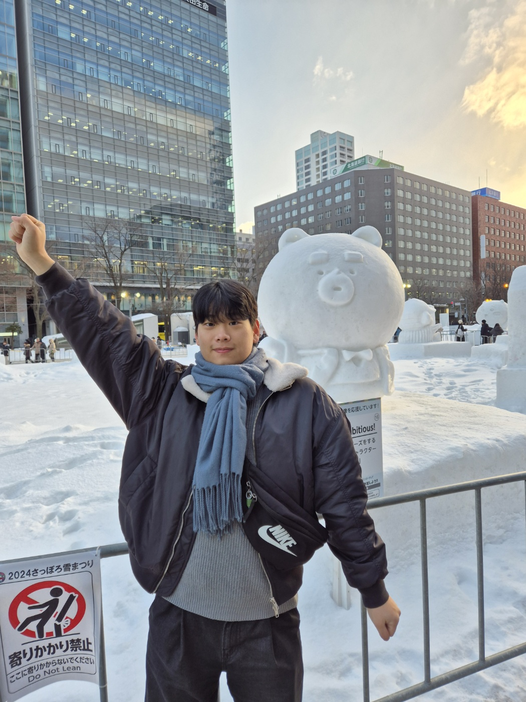
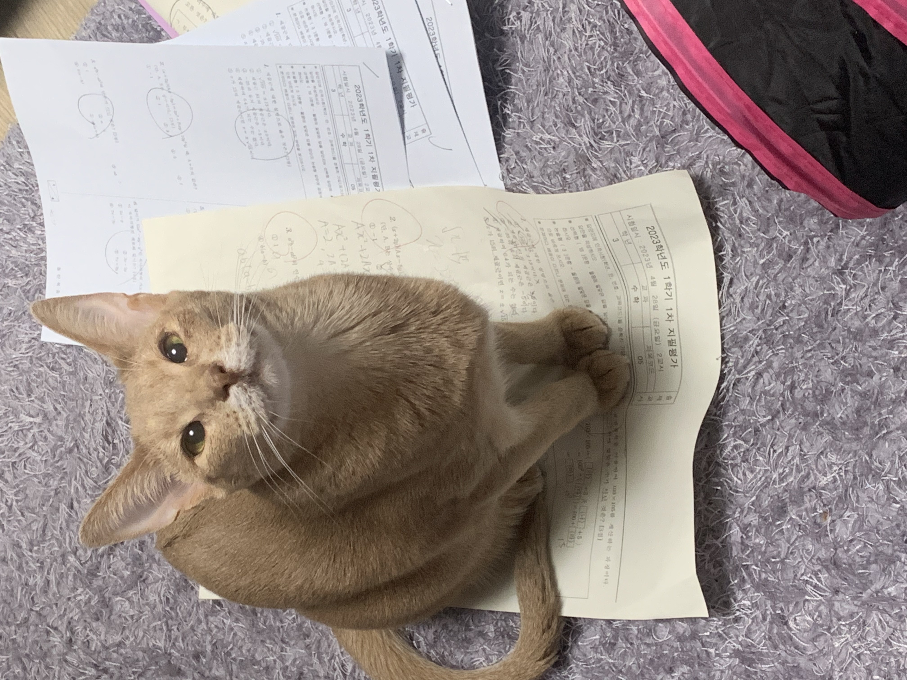

# 멋사 12기 자기소개
 

## 개인정보
- 이록희
- 건설환경공학부 21학번
- 2002년생
- ENTP
- 서울대학교 방송 SUB 보도기자

 

## 사진

 올해 2월 삿포로 눈 축제를 다녀왔습니다. ㅎㅅㅎ

</img>

 <em>겨울 삿포로 여행 꼭 다녀오세요..!!</em>

 

## 좋아하는 것과 싫어하는 것
### 좋아하는 것
- 치킨
- 햄버거
- 국밥
- 리그 오브 레전드
### 싫어하는 것
- 단무지
- <Strong><em>짜장면 위의 오이</Strong></em>

 

## 반려동물
- 이름 : 망고
- 나이 : 3세
- 종 : 고양이
- 품종 : 아베시니안
 

</img>
- 특징 : <Strong><em>수속성 고양이, 아주 귀여움</Strong></em>
